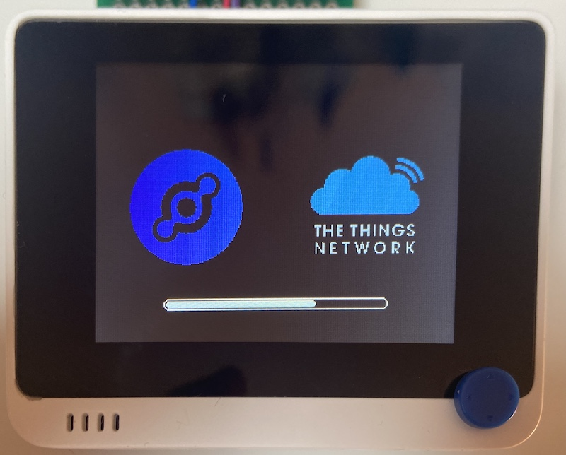
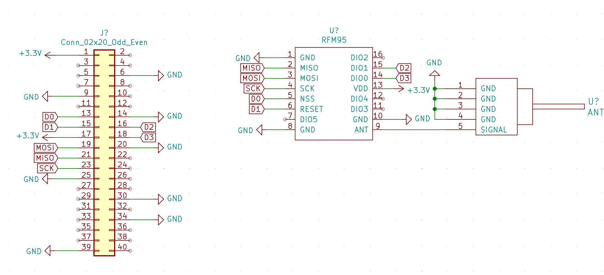

# Wio Terminal LoRaWAN Field Tester

## What's is it about

When deploying a LoRaWAN network you want to know your gateway coverage and measure the radio performance in different places. When deploying Helium network you particularly want to know how many Hotspot around can be touched for a given position.

There are some existing tools for such application but the cost is about $200. The idea of this project is to propose a simple tool you can build on your own with low cost hardware to fulfill this purpose.

The solution is based on low cost products, easy to find for about $50:
- [Wio Terminal](https://wiki.seeedstudio.com/Wio-Terminal-Getting-Started/)
- [RFM95](https://www.disk91.com/2019/technology/lora/hoperf-rfm95-and-arduino-a-low-cost-lorawan-solution/)

## Current status
- Working, documentation in progress to reproduce it on your own.

## Features
- Easy selection for Power / Sf / max retries
- Duty cycle status display
- Last setting flash memory backup
- Graph selection display
	- Rx Rssi - ack Rssi level 
	- Rx Snr - ack Snr level
	- Retries - number of retry before getting a ack
- Manual / Automatic mode switch
- Display last frame information
- Network side RSSI / SNR / #of station
- Your favorite network splash screen (select in config.h)
- Screen shot and user guide

## Comming soon features
- RFM95 Schematics
- PCB
- Serial port LoRaWan setup configuration
- GPS extension
- sdcard data storage

## How it works

The LoRaWan Field tester is basically sending a frame on demand or in regular basis and wait for an ACK. We can obtain the ACK RX power, eventually the number of retries needed to get it. Then this message is passed to a backend service. This service is responding in a downlink with the network reception level (TX rssi) and the number of hotspots involved in the reception.

 

You can select the transmission power to be used, the spread-factor (speed), the maximum retries allowed by selecting the parameter to modify with the button located on the top side. Once selected, you change the values with UP & DOWN from the 5 directions button.

When none of these parameters are selected, you can change the mode with the UP & DOWN. The following modes are available:
- Manual : a frame is fired when pushing the 5 ways button. The downlink response is obtained by pooling.
- Auto 5m : a frame is fired automatically every 5 minutes. The downlink response is obtained by pooling.
- Auto 1m : a frame is fired automatically every 1 minute. The downlink response is obtained by pooling.
- Max Rate : a frame is fired as soon as the device can regarding the eventual Duty Cycle. Downlink response will be received later on the flow and will onlu be monitored from the historical graph.

The status is displayed on the screen and can be:
- Disc - disconnected or not yet connected
- Join - device is joining the network
- Cnx - device has joined, ready to fire messages
- Tx - transmisison in progress (orange when doing a retry)
- Dwn - communication in progress to retrieve the downlink containing the network side informations

On Green / Red square on the righ is indicating the duty-cycle status when applicable. Green is ready to communicate, Red is duty-cycle with the count-down before being ready.

The last communication result is displayed on the 2 lines under the settings.
- The first line shows the device side information ( from left to right ):
	* The sequence ID of the frame
	* The Rssi of the Ack message as received by the Field tester
	* The Snr of the Ack message as received by the Field tester
	* The number of repeat before obtaining the ack response
- The second line shows the network side information ( from left to right):
	* The minimum RSSI value from the different hotspots having received the frame
	* The maximum RSSI value from the different hotspots having received the frame
	* The number of hotspot having received the frame.

Rq : due to the way Helium works or due to the TTNv2 to TTNv3 migration, the second line could display a reduced number of Hotspot compared to the reality. For Helium where this information could be critical, make sure you have done all the configuration steps and bought all the frame setting. Currently Helium has a bug and not execute this action correctly so in most of the cases you will have only one Hotspot response. I'll update that documentation once it will be fixed.

All these information can be displays with an historical graph you select using the LEFT & RIGHT buttons:

In the historical graph, a red cross is indicating a packet loss a green cross a 0 value.
The TX Rssi graph is displaying a min-max bar, this is why you see just a line for a single hotspot response.

## Schematics

Here is the simplified version of the schematics for DiY implementation.
 

## Installation

The installation details are available in the related [Wio LoRaWan Field tester on disk91.com](https://www.disk91.com/?p=5187) 

