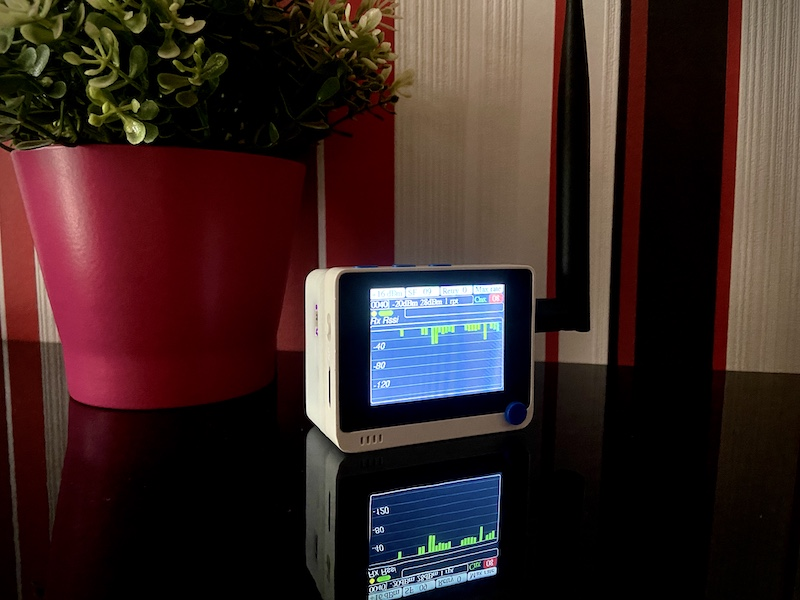

# Wio Terminal LoRaWAN Field Tester

## What's is it about

When deploying a LoRaWAN network you want to know your gateway coverage and measure the radio performance in different places. When deploying Helium network you particularly want to know how many Hotspot around can be touched for a given position. Then you want to enrich the network mappers to know and share the real network coverage.

There are some existing tools for such application but the cost is about $200. The idea of this project is to propose a simple tool you can build on your own with low cost hardware to fulfil this purpose.

The solution is based on low cost products, easy to find for about $50:
- [Wio Terminal](https://wiki.seeedstudio.com/Wio-Terminal-Getting-Started/)
- [RFM95](https://www.disk91.com/2019/technology/lora/hoperf-rfm95-and-arduino-a-low-cost-lorawan-solution/)
- Quectel L80 / L86 GNSS

The solution also supports ready for use hardware:
- [Wio Terminal](https://wiki.seeedstudio.com/Wio-Terminal-Getting-Started/)
- [LoRaWan Chassis](https://www.seeedstudio.com/Wio-Terminal-Chassis-LoRa-E5-and-GNSS-p-5053.html)
- [Battery Chassis](https://www.seeedstudio.com/Wio-Terminal-Chassis-Battery-650mAh-p-4756.html)

`============================`

`If you are using a Seeed bundle, it is already setup, you don't need to do anything more`

`============================`

## How it works 

To get a better understanding on how WioLoRaWANFieldTester works, [read this page](doc/HowItWorks.md).

## Features
- Easy selection for Power / Sf / max retries
- Duty cycle status display
- Last setting flash memory backup
- Graph selection display
	- Rx Rssi - acked Rssi level 
	- Rx Snr - acked Snr level
	- Retries - number of retry before getting a ack
	- Tx Rssi - network side Rssi 
	- Hotspots - network side hotspot 
	- Distance - hotspot distance (in progress)
	- GPS status - current GPS status
- Manual / Automatic mode switch
- Display last frame information
- Network side RSSI / SNR / #of station
- Your favourite network splash screen (select in config.h)
- Screen shot and user guide
- RFM95 Schematics
- GPS position reporting with Helium mapper integration
- LiPo charging mode detection
- PCB available
- Enclosure available
- Serial port LoRaWan setup configuration
- End-user setup screen
- Setup with Cargo (helium tracking platform)
- Ready for industrial production with credential commissioning
- Support firmware upgrade w/o credential loss (LoRa-E5 only)
- Reduce uplink messages when device is not moving / out of coverage
- Discovery Mode - allow to see hotspot communications on a map (external website)
- Works with TTN and Helium
- Lock key & switched screen off mode

### Coming later features
- sdcard data storage

## Get your own device

The WioLoRaWANFieldTester board can be
- [Make](board/README.md)
- [Buy & DiY](https://shop.ingeniousthings.fr/products/helium-lorawan-field-tester-and-mapper-kit) as a kit
- [Buy](https://www.seeedstudio.com/Wio-Terminal-Chassis-LoRa-E5-and-GNSS-p-5053.html)

## Quick installation and setup

Read and follow the steps in [WioLoRaWANFieldTester configuration documentation](doc/SETUP.md)

## Use it

Read the [User Guide documentation](doc/UserGuide.md)

## Troubleshooting

### All frame "LOST" in US915 SF10

The US915 SF10 is restricting the size of uplink and downlink. Uplink is adapted but donwlink frame is currently too large. The Uplink are correctly sent but the "LOST" status is indicated when the Downlink is not received. So "LOST" is always displayed. 
Do not use SF10 in US915 if you want to get the uplink information. This will be fixed in a later version. Mapper and tracker features are working correclty even this.

### I can't change the factory setting

The Seeed bundle comes with ready to use credentials. You don't need to setup your device. If you want to move your device out of the factory credential and move the device to your own console account or TTN, you can follow the [documentation here](https://github.com/disk91/WioLoRaWANFieldTester/issues/34). Once done, you won't be able to rollback to factory settings.

### GPS never fixing (even outdoor)

Some of the LoRa-E5 chassis have an incorrect default UART speed at 115200. To reset it to the normal value, flash the firmware [Gps_Reset_To_9600bps](binaries/Gps_Reset_To_9600bps.uf2). Then you wait for about 1 minute and then reflash the latest version. This should fix it.

## Contribute to development

Read the [developer documentation](doc/DEVELOPMENT.md)

