# Configure cargo

** Work in progress to make this page more User friendly... **

## Cargo integration

[Cargo](https://cargo.helium.com/) is a tool from Helium to display real-time tracking device position on a map. This tool displays your position publically but is really easy to use. As is also displayed the coverage map as an extra layer, it is a usefull tool to find the hexagone not yet tested to complete the coverage map.
In this tool, you will search your device by its name, the use of a uniq name will help you to find it.

To make Cargo working with WioLoRaWANFieldTester, we need to create a decoding function to pass it the device coordinate in the righ format.

## Setup a decoding function

Create a decoding function from the [Helium console](https://console.helium.com) dashboard. Click on the **+** button and select **Add function**

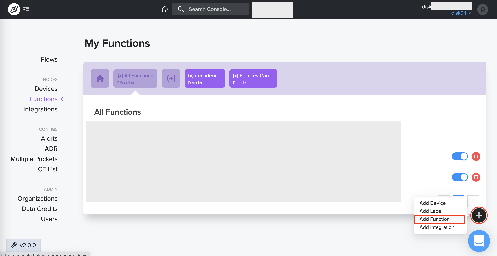

Once in the **Add function** screen, you need to give it a name:

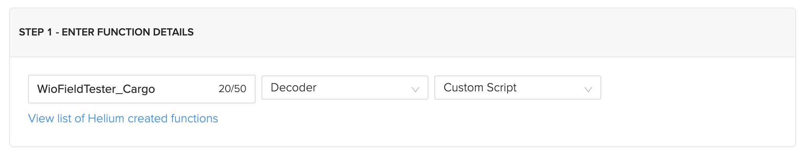

Then you can type the decoder function. This function will proceed the payload received from the device and convert it in a structure the Cargo application is able to understand.

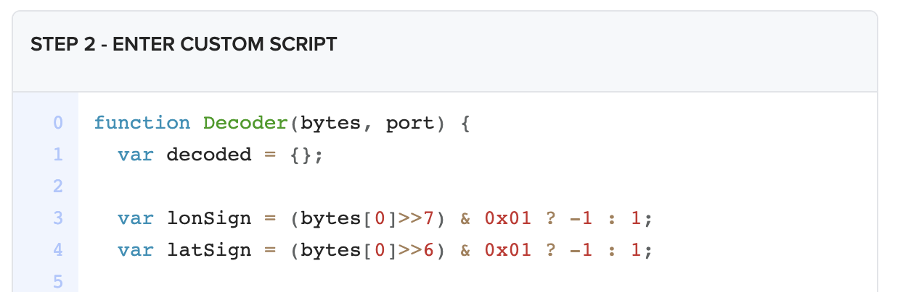

Copy & Paste the follwoing JS content into the decoder textarea:

```
function Decoder(bytes, port) { 
  var decoded = {};
  
  var lonSign = (bytes[0]>>7) & 0x01 ? -1 : 1;
  var latSign = (bytes[0]>>6) & 0x01 ? -1 : 1;
  
  var encLat = ((bytes[0] & 0x3f)<<17)+
               (bytes[1]<<9)+
               (bytes[2]<<1)+
               (bytes[3]>>7);

  var encLon = ((bytes[3] & 0x7f)<<16)+
               (bytes[4]<<8)+
               bytes[5];
  
  var hdop = bytes[8]/10;
  var sats = bytes[9];
  
  const maxHdop = 2;
  const minSats = 5;
  
  if ((hdop < maxHdop) && (sats >= minSats)) {
    // Send only acceptable quality of position to mappers
    decoded.latitude = latSign * (encLat * 108 + 53) / 10000000;
    decoded.longitude = lonSign * (encLon * 215 + 107) / 10000000;  
    decoded.altitude = ((bytes[6]<<8)+bytes[7])-1000;
    decoded.accuracy = (hdop*5+5)/10
    decoded.hdop = hdop;
    decoded.sats = sats;
  } else {
    decoded.error = "Need more GPS precision (hdop must be <"+maxHdop+
      " & sats must be >= "+minSats+") current hdop: "+hdop+" & sats:"+sats;
  }

  return decoded;
}
```

## Setup Cargo integration

Now you need to create an Integration with Cargo, for this, create a new integration

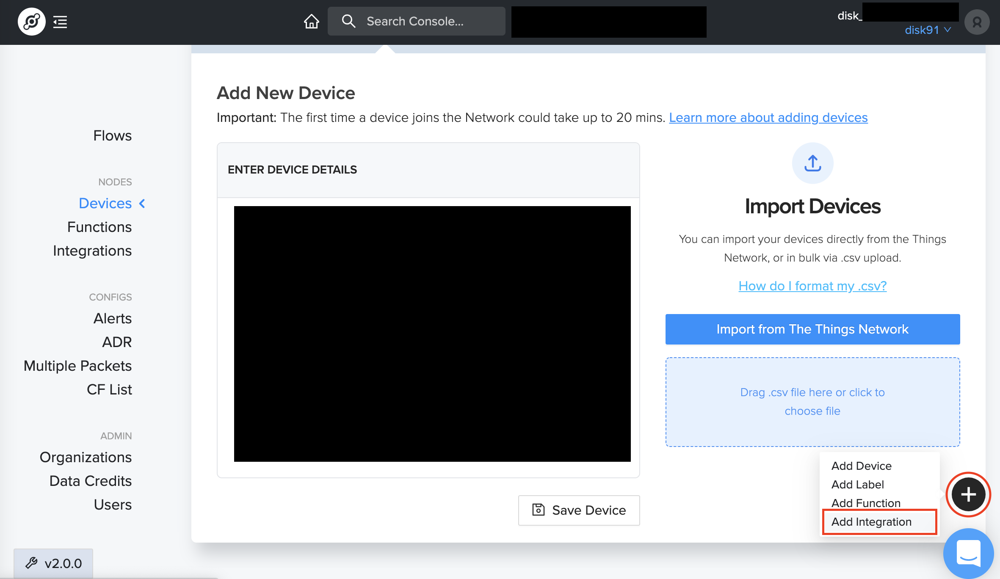

You need to select the type of integration, here it is **Cargo**:

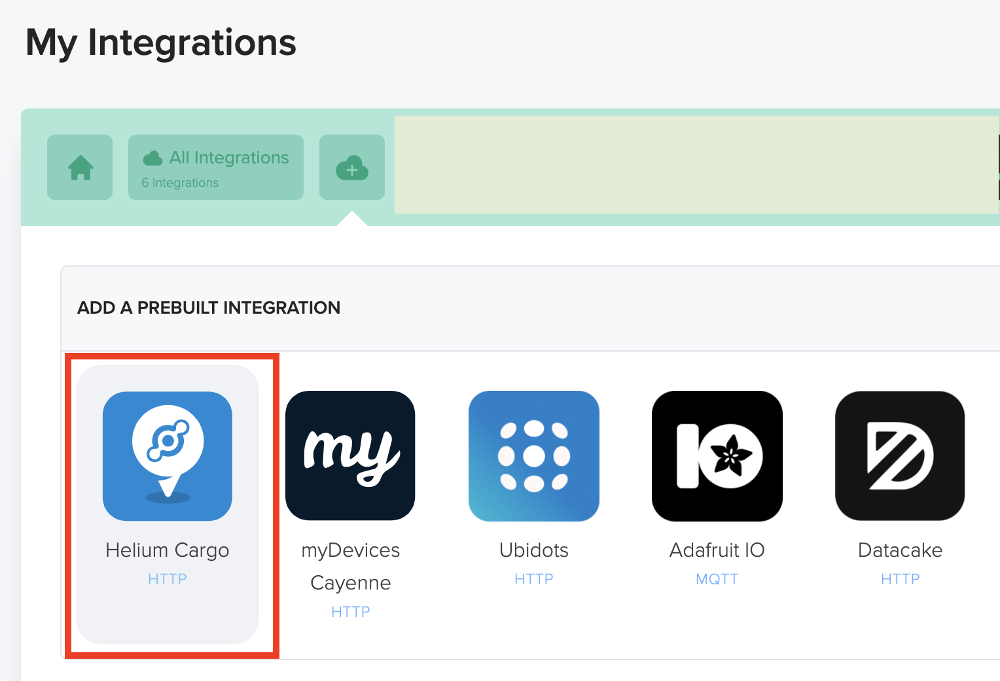

Please read the warning about data privacy and accept it if you agrea on the terms:

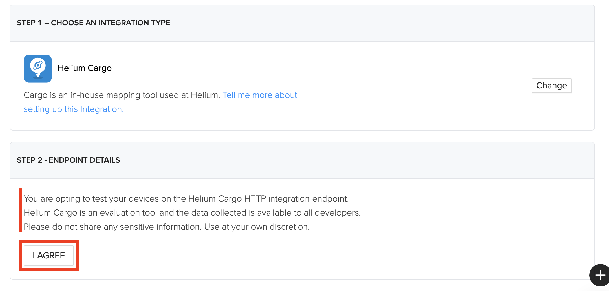

Now you can give a name to this integration:

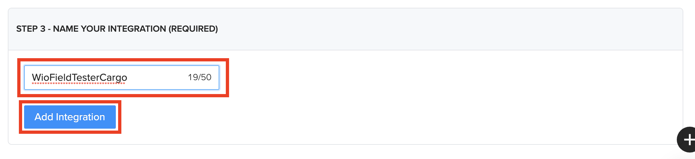

As you can see, we do not need to give details about the integration endpoint, by selecting Cargo integration, the console automatically knows how to transfer the informations. 

## Setup Cargo flow

Now, you need to make the link between our **Label**, the created **Function** and the Cargo **Integration**.
For this you, go the the **Flow** panel:

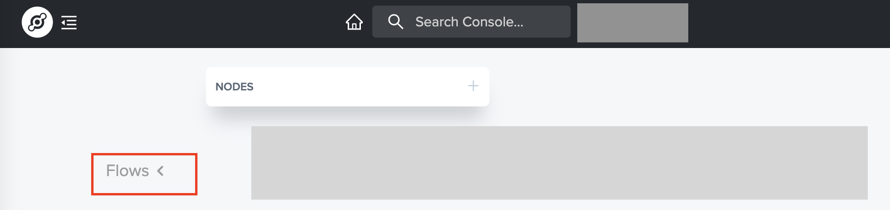

Once in it, you can extend the Node to access the different tabs:

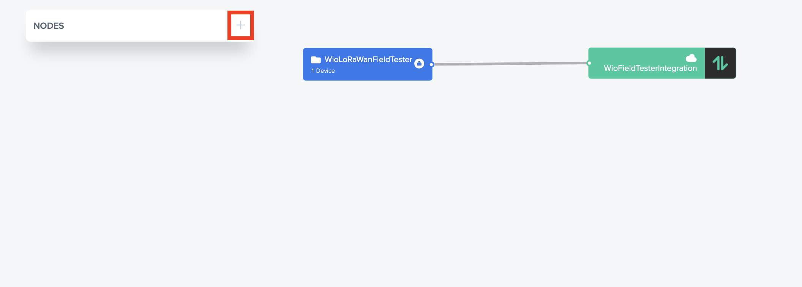

Then you need to insert the **Function** previously created by selecting the Function tab, then drag & drop the created function into the flow diagram:

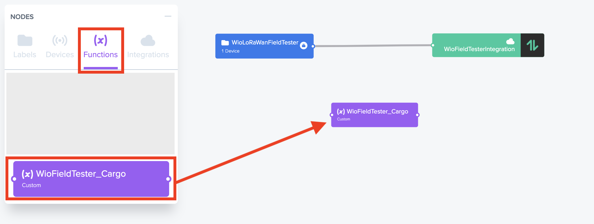

Then you need to do the same with the Cargo **Integration**. Select the Integration tab and drag & drop the Cargo integration you previously created.

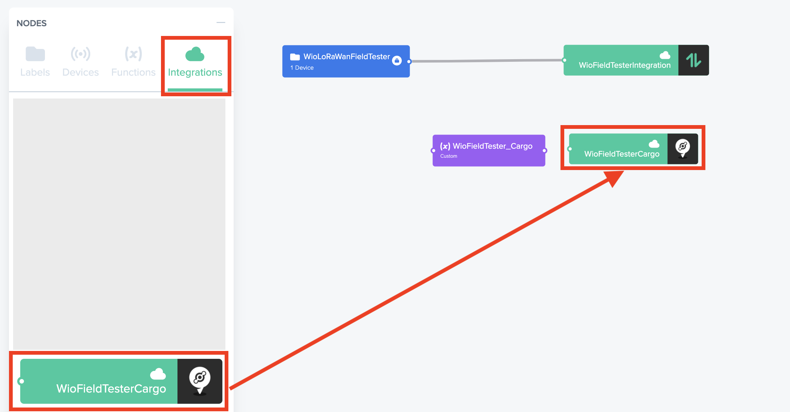

All these components, now, need to be linked together to create the flow. Click on the node's connectors and drag your mouse up to the destination.

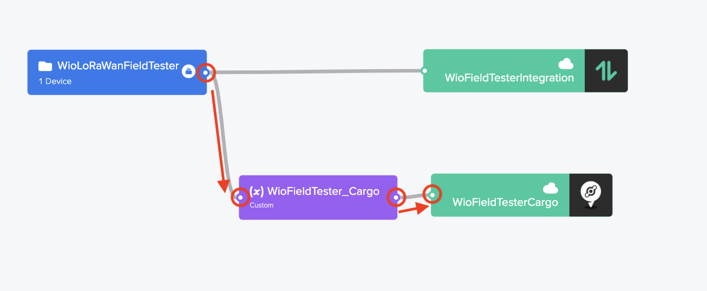

To make sure all these changes will be applied, don't forget to **Save** your changes:

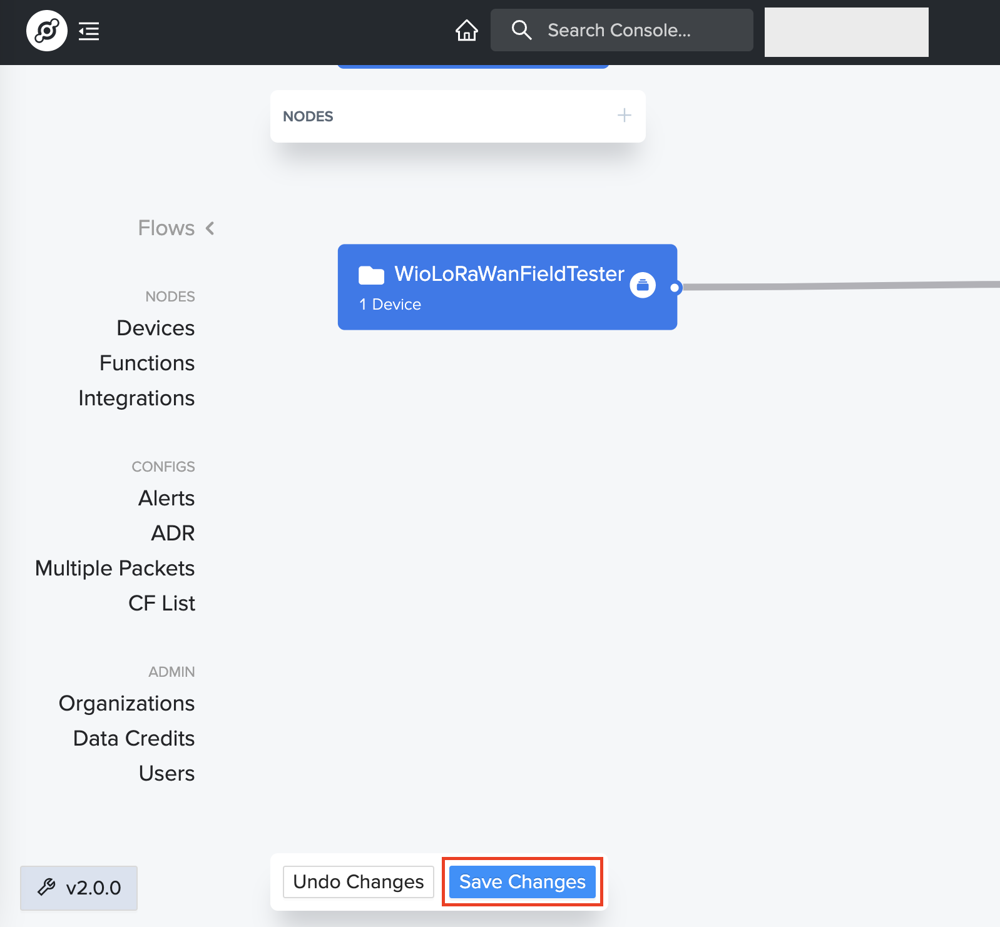

## Your Cargo setup is **DONE** you can go back to [installation page](SETUP.md) for the next steps
