# Configure device in the Helium console

This describes the different steps to configure the device on the [Helium](https://www.helium.com) network.

## Join Helium console

Skip if you already have an account on helium console.

You need to create an account on the [Helium console](https://console.helium.com). This is free and you get 10.000 Data Credit (DC) for the registration. This is large enough to start for a couple of month to year of device use. You can later buy extra DC, 100.000 DC correspond to $1.

Once you have your account created, you can register your device. We are going to create a Label: this is basically a group of devices where common settings apply. Then we will create a Device to get the required credentials to identify the device. This device will be attached to the label.

Then we are going to create an integration with WioLoRaWANFieldTester backend. As explained in [How it works](HowItWorks.md) page, this allows the device to receives computed informations from the network and automatically report the coordinated to the [helium mapper](https://mappers.helium.com)

## Create a Label

From the Helium console dashboard, click on the **+** icon and select **Add label**

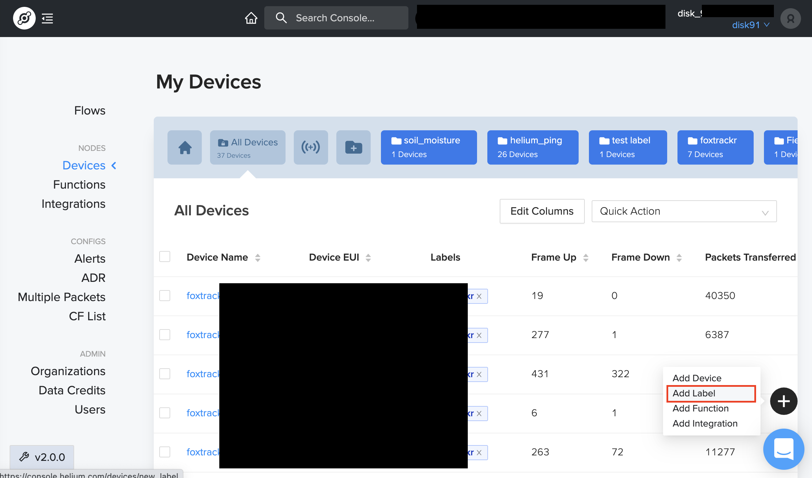

Then, enter a *Label* name and **Save** it.

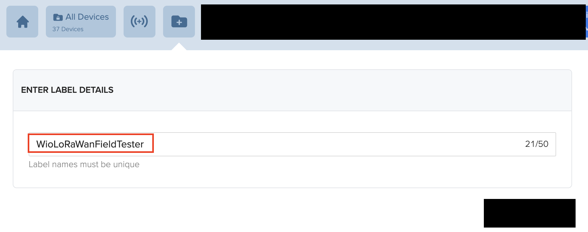

## Create a Device

From the Helium console dashboard, click on the **+** icon and select **Add device**

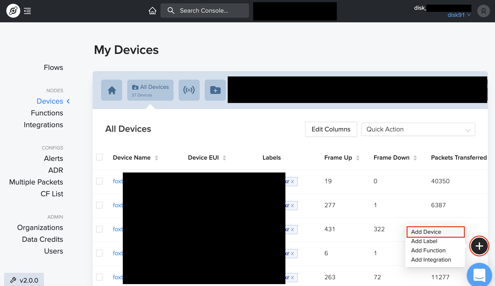

Then, enter a **Name** and Search the **Label** you created previously to make the attachment. You need to click on the Label name once displayed to add it in the form field. Then Save.

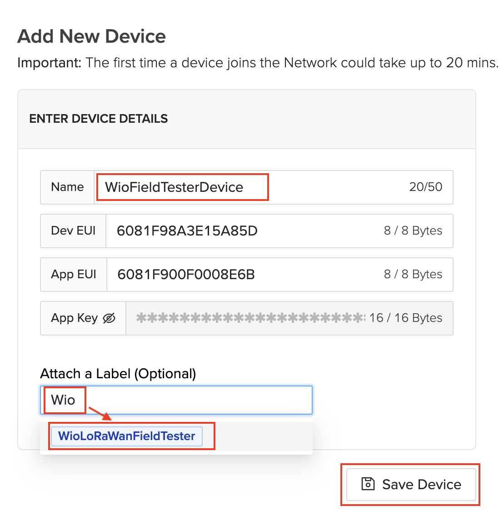

Here you can see the device credential. There is no need to save them during this step, we will later see how to get and use them to setup the device.

## Create the Integration

From the Helium console dashboard, click on the **+** icon and select **Add integration**


The integration is **HTTP** type, it means the data will be redirected to a custom URL. You can get details on this in the [How it works](HowItWorks.md) page.

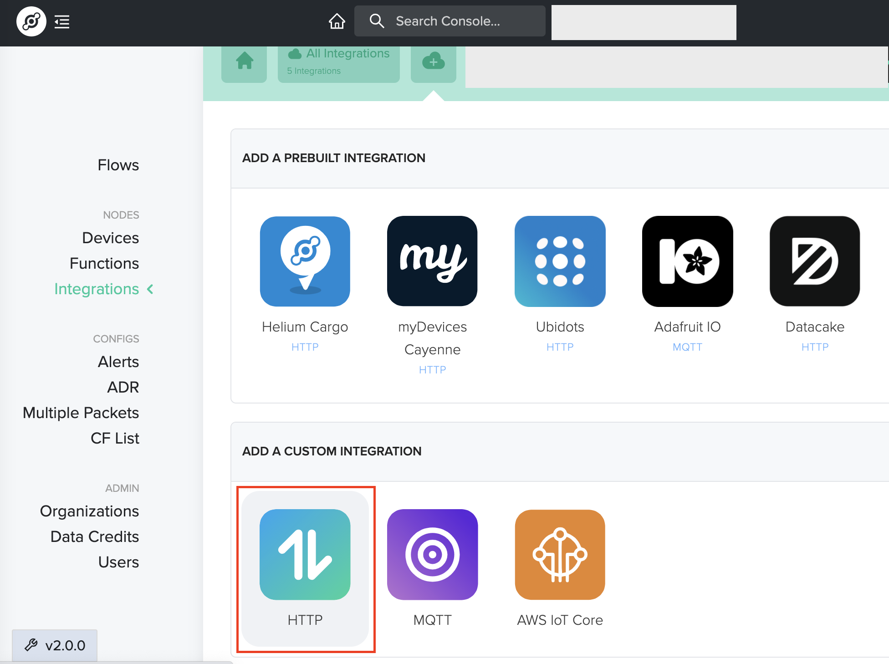

Now you need to setup the integration by entering the target endpoint. Ensure the type is **POST** and enter as Endpoint URL: 
```
https://dev.disk91.com/fieldtester/helium/v3
```
At the end of the form, enter a name of your choice for this integration and click on **Add Integration**

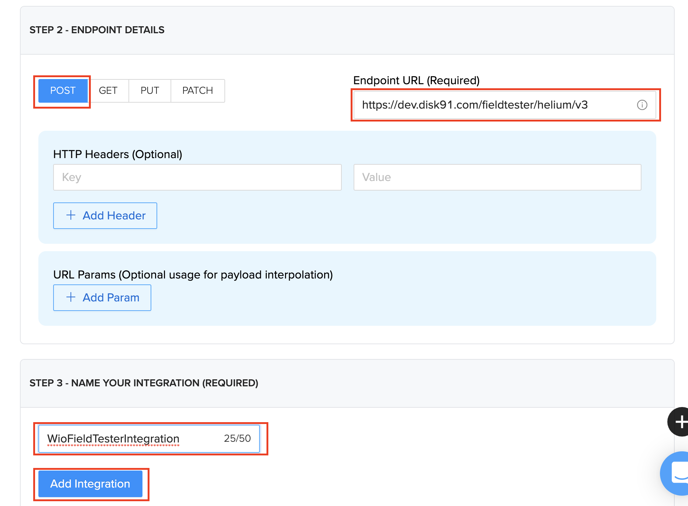

## Create a flow to link the Integration with the Label

We need to create a link between the Label and the Integration. Thanks to this, the Helium router will know that any data coming from one of the devices of the given Label will need to be transferred to the custom backend on dev.disk91.com.

From the console Dashboard, click on **Flow** to access the setup page.


From the flow page, click on **Nodes** to extend the object's panel, then select **Labels** tab and drag & drop the Label you created previously to the flow page background.

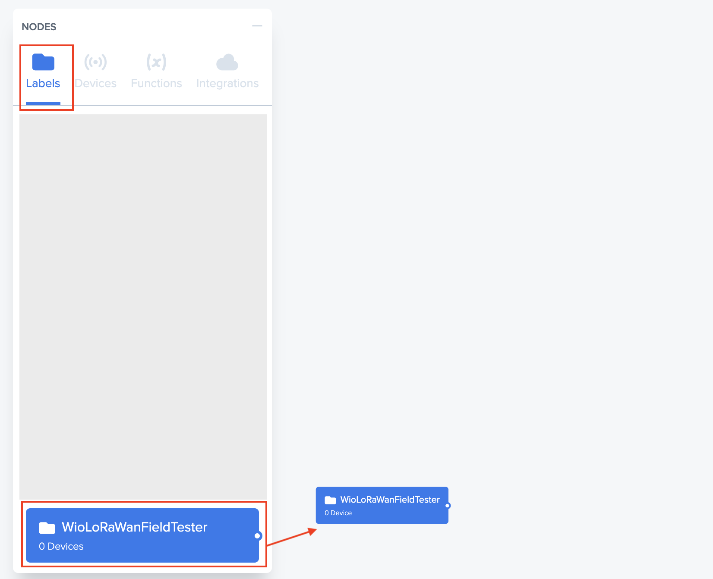

Then you can select the **Integrations** tab and drag & drop your previously created integration to the flow page background.

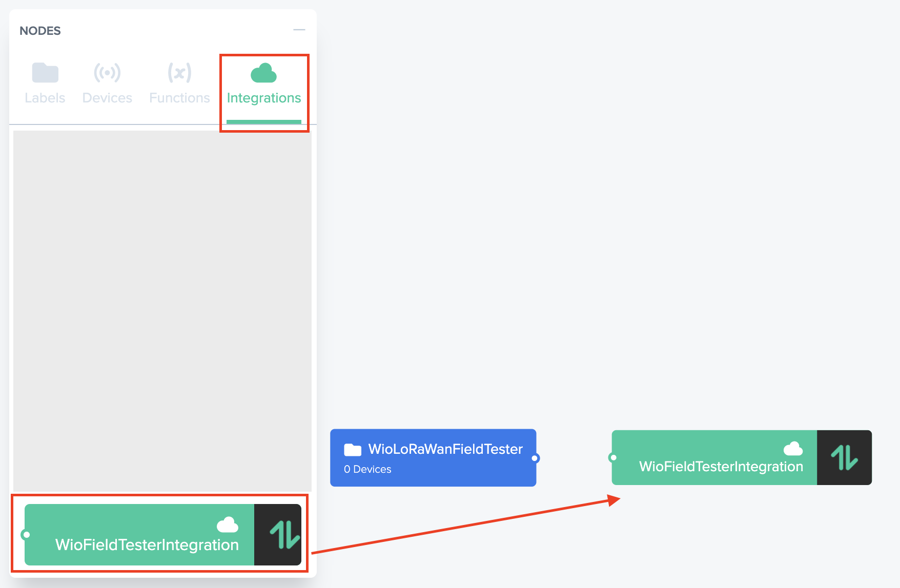

Now, you need to link the Label to the Integration, for doing this, click on the Label connector (circle on the right of the Label) and drag your mouse to the Integration connector (on its left). It should be like the picture above.

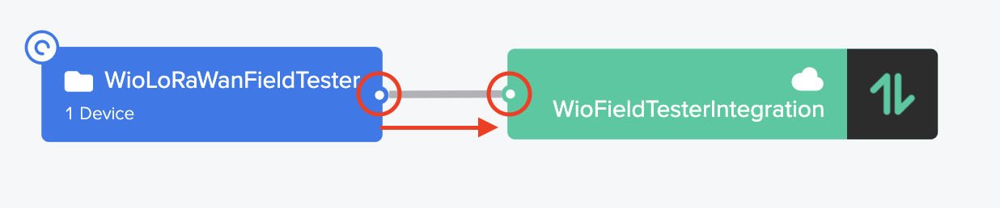

## Configure the Label to buy all the replicate packets

Basically on Helium network, even if all the Hotspots around receives the Data, only one of them is basically bought by the Router to one of the Hotspot. This is because, one single frame is enough if you are only interested by the data transported. 
If you want to obtain more informations about the local network like the list of hotspot having received the message, you need to ask the router to buy more replicates of that frame coming from different Hotspots. Thanks to this, we will be able to display on the device a range of signal straight and the number of hotspot having received the message.
As a consequence, each message processed will cost 1DC each (plus ack cost). 
If you want to preserve your DC spend you can limit the number of messages bought by router.

You also need to know that currently the router, most of the time, only returns 1 message, even if many other exists. It is still under investigation by Helium.

To configure the number of packets to be bought, you need first to create a **Multiple Packets** configuration.
Give it a name and select the number of packets (replicates) you want to buy as a maximum. Then create this configuration.

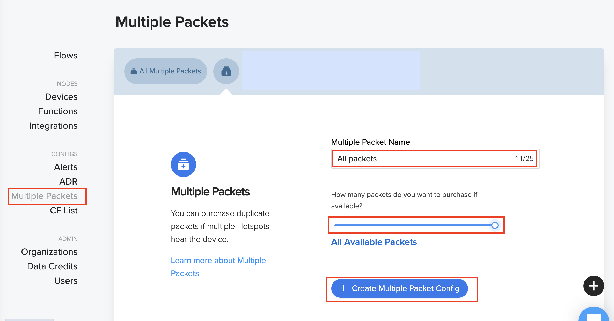

Now we need to associate this configuration to the Label on the **Flow** page


Then click on the **Label** displayed on the Flow background page to edit its setting. Select the **Packets** tab and in this page, enable the corresponding **Multi-packets** configuration.

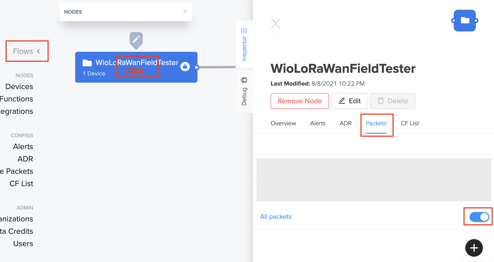

After doing this, you need to **Save** the flow settings.


## Next steps

Go back to [installation page](SETUP.md) to continue the configuration


