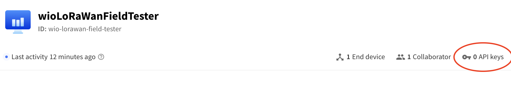
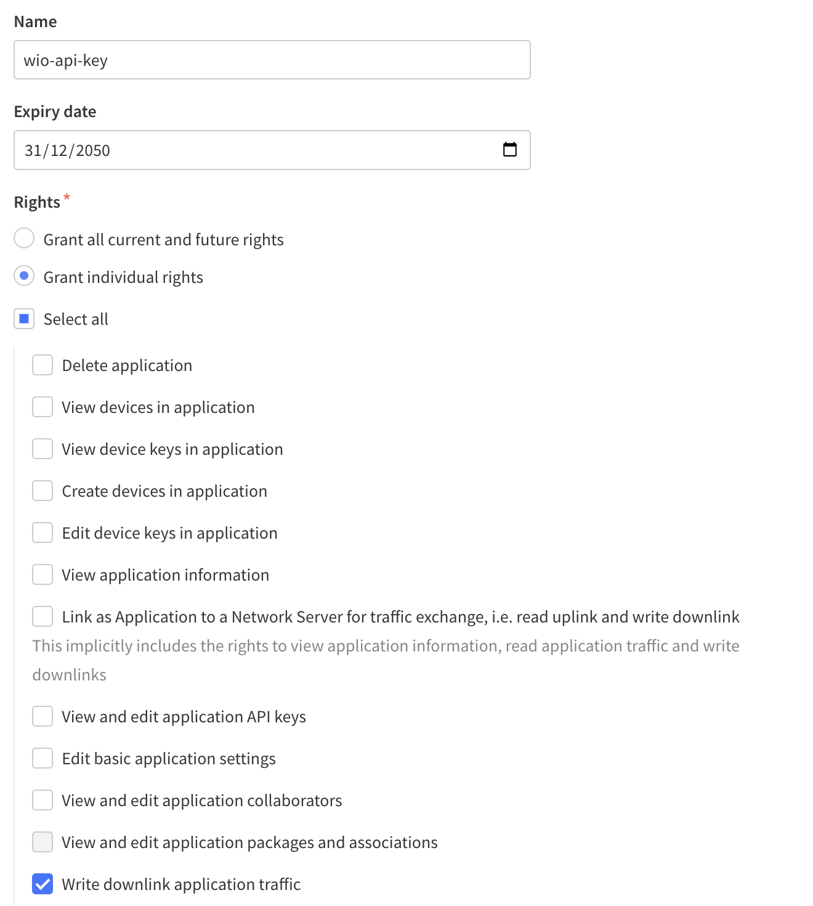
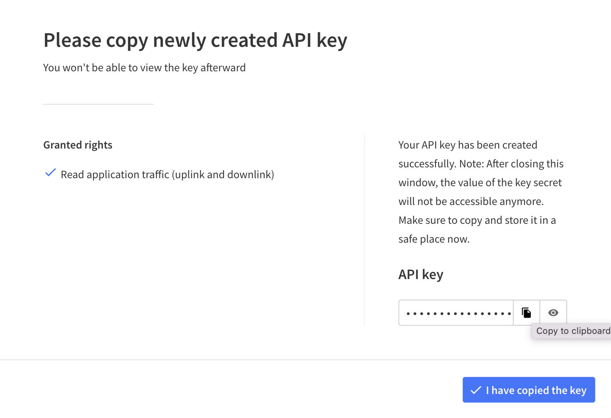
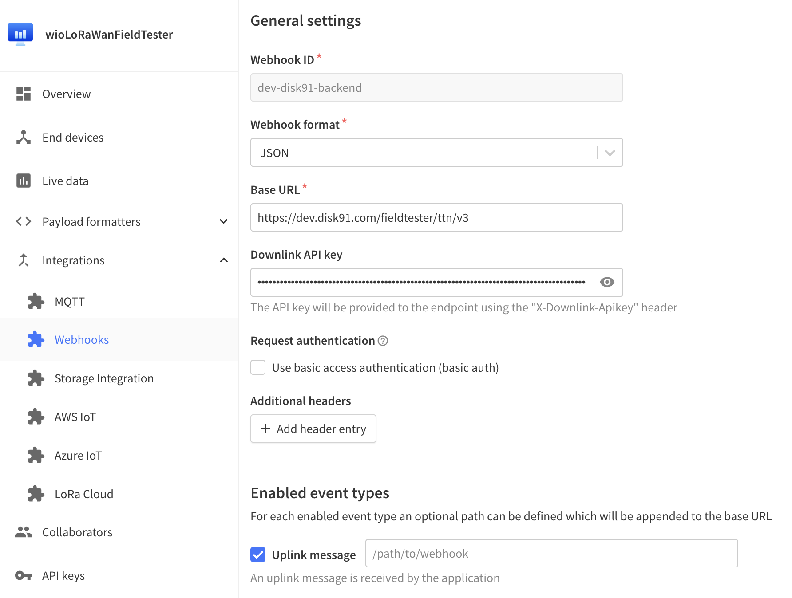

# Configure device in the TTN console

This describes how to link the WioLoRaWanField tester with TTN network.

## Create an application

The first step is to create an application in TTN console. You can name it the way you want, like _wioLoRaWanFieldTester_.

In this application, you need to create an API key.

Give it a name, select a date in the future, select the __Write downlink application trafic__ right for it. 

Once you have validate this, you reach the last page with the API key created. Copy the key into the clipboard and save it, we will need it in the coming step.

## Add a integration type WebHook

Now we are going to create an integration using a webhook with the backend on disk91.com. This backend is computing the information displayed on the Wio.

The base URL to be used is : `https://dev.disk91.com/fieldtester/ttn/v3`

You need to copy the API key, previously saved, into the Downlink API Key field.

Check the __Uplink message__ event type to activate.

## Create your device

Now you can create your device into this application and get your credentials.

The Application EUI is by default set to 00..00, you need to change this to anything else to be able to configure your WioLoRaWanFieldTester.

Use Lora Specification 1.0.3 for LoRa-E5 modules.

Then you are ready to start mapping.