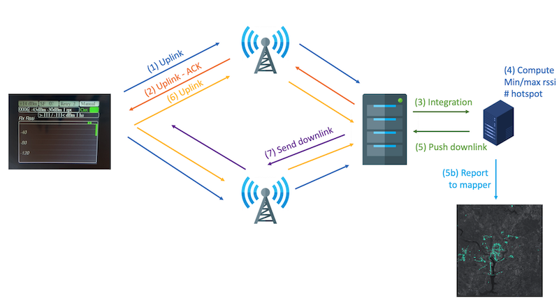
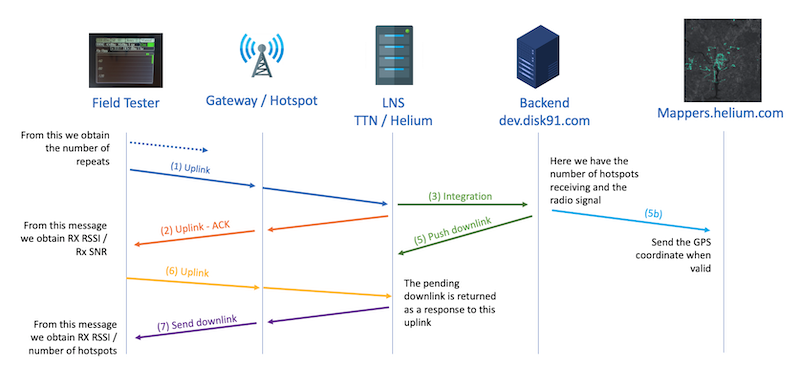

# Understand how WioLoRaWANFieldTester works

## Principles

The WioLoRaWanFieldTester provides different features, all-in-one:
- Field Tester - it allows to monitor the LoRaWan / LongFi network performance from the field. That way you can verify the coverage and know the different Gateways / Hotspots covering a given place. It helps to find the best places to deploy new Gateways / Hotspots, compare different places to optimize the network deployement.
- Mapper - it automatically transfer the positions to the network mappers - [helium](https://mappers.helium.com) and [coveragemap](https://coveragemap.net/) - to create a map of coverage. This map is really important to understand where it is posible to use the network. It is a key point for giving trust on the network and motivate the service providers to use it.
- Tracker - it can be connected to tracking services like [cargo](https://cargo.helium.com) to track cars, people, assets in real time.

For doing this, the terminal is connecting to the network and sending messages on regular basis. The onboarded GPS is getting the device position in real time. This message is acknoleged by the network to retreive the information requested for field testing.
Then, each of the messages are processed by a dedicated application computing advanced Field Testing information later transmetted back to the device.
When the GPS signal quality is correct, the location is transfered to the mappers and tracking services.

All the Field Testing information are displayed on the Wio Terminal screen where you can also setup different radio parameters.

## Architecture
The solution involves different components:

- The WioTerminal, sending the communication and displaying the results
- The gateways / Hotspot receiving the traffic
- The network server relaying the traffic to the application server and enriching with the network signal informations
- The application server, building the downlink message for returning the network signal information to the Wio Terminal.

Here you can see a schema of the different communications between these components:

... and the way, they are interacting over time:

(1) The device sends messages on regulat basis based on the selected strategy (max rate, 1 minute...)
	Each of the messages can be lost over the air, based on the repeat setting, the device will retry the same message until it gets a ACK from the network.

(2) When the message is received by the network, the network respond with an ACK to confirm reception. 
	The device, when receiving this response gets the reception radio levels (RSSI - Signal Strength and SNR - Signal over Noise)

(3) In parallel, when the message is recived by the network, the network process the message data.
	These data are pushed to a dedicated backend server deployed to process these data. The most important point in this step is that the network server add Meta-data to the message data. As part of these meta-data, it adds the list of Gateways / Hotspot having received the message. That way, the backend server can determine the number of Gateways / Hotspots covering a single zone including the signal strength for each of them.

(5) The meta-data result is returned to the device to be on-field displayed.
	The backend server computes a response to the device with the number of hotspots having received the message and the signal lower and higher limits. These data will be pushed back to the device through a downlink communication. The device will later display these information in the different screens.

(5b) The device position is pushed to the mapper services.
	When the position quality is good enough (hdop quality is under 2.0 and satellites in view over 5), the backend server is pushing these informations to the associated mapper automatically. This helps to construct community coverage map. Helium mapper and Coveragemap service are transparently connected.

(6) The device now looks for pending downlinks by quering through a new uplink communication. 
	When the device is max rate mode, this step (6) is integrated to the next step (1). In the other mode, the step (6) is following the step (5).

(7) The network responds with a downlink containing the information computed by the backend server.
	When downlinks are pending, the network sent it. The device process the data to enrich the different boards and if multiple downlink are pending, it gets them all.

See more details on how it works on [Wio LoRaWan Field tester on disk91.com](https://www.disk91.com/?p=5187) 

## Network Server

The network server, also named *console* or *router* for Helium network is configured to process the data and transfer them to the backend server. The [setup documentation](SETUP.md) describes the way it works.

## Backend Server

The backend server is free to use, the endpoint is documented in the *setup guide*. The source code of the server is not provided because as it is deployed on a multi-purpose IoT backend server it is currenlty too much complicated for me to extract its code for a standalone use and open-source this.

You can easily create your own backend server, if you do not want to use the one I'm offering, as the message format are documented in the [developer guide](DEVELOPMENT.md)

The WioLoRaWan field tester can also works without the backend server:
- You can get the network information (2) without it
- You can directly connect the network server to the mapper without passing through the backend server.

## Running cost and fair use

- When running the WioLoRaWANFieldTester on TTN, you need to respect the [fair-use policies](https://www.thethingsnetwork.org/docs/lorawan/duty-cycle/). Basically, you should only use the manual mode and a maximum of 10 tests / days due to the downlink limitation. There is nothing blocking over this.
- When running the WioLoRaWANFieldTester on Helium, there is no fair-use policies but each communication has a cost in DC. 100.000 DC costs $1 per design. A communication consists in an Uplink, a Downlink or a Repeat. Intensive usages can have a signifiquant cost. Classical use is about 2000 messages / month - $0.05

