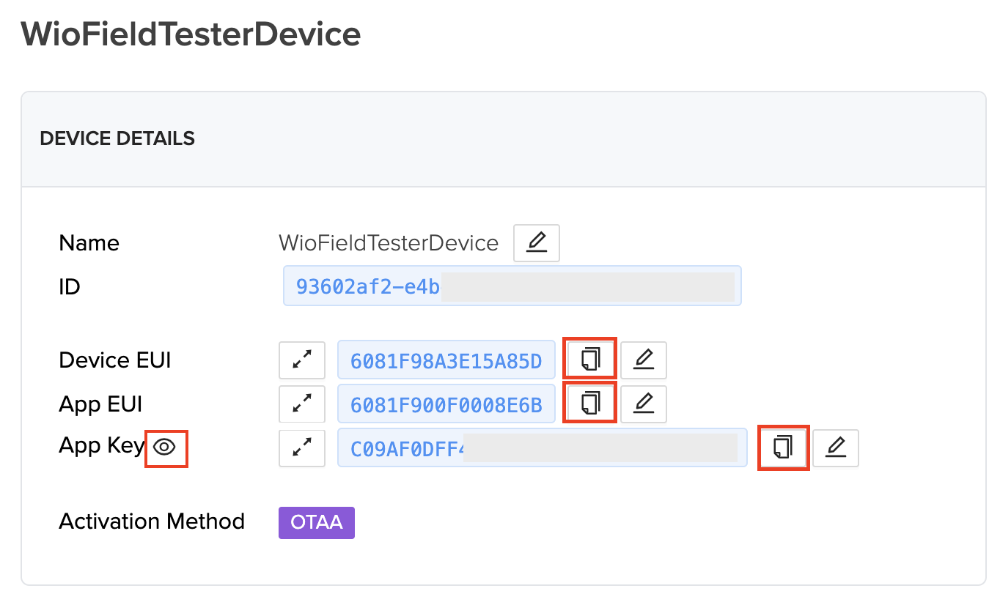
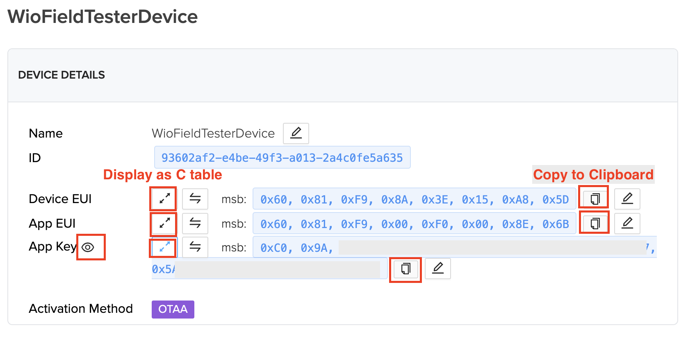

# Obtain your device credential from [Helium console](https://console.helium.com)

You have previously created a device in the helium console. Now we need to setup the device with the created credentials. These credentials will be used in the next step and transfered to the device.

## Acces the device credentials (Quick install)

From the [console dashboard](https://console.helium.com), access the device page and search for your device. Click on its name to get the details.

Once you are on the device page, you can access the device credentials. For the standard use of them, you need to get the hexadecimal string of each of the credentials. For this, you can directly use the **Copy to clipboard** icon to get each of the credentials. The DevKEY is displayed clicking on the **eyes** icon before using the **copy to clipboard** icon.

## Next steps

Go back to [installation page](SETUP.md) to continue the configuration

## Access the device credentials (For developpers)

This is only for developper, quick install do not requires to care about this part.
Developers can prefer to force certain credentials instead of re-configuring the device after each firmware upload. In this case, the file key.h can be modified to contain the device credentials.

To get these credential, access the device detail page the same way as previously.

Then, Click on the the **C table switch** and **Copy to clipboard** to copy the data and paste into the _key.h_ file. 

