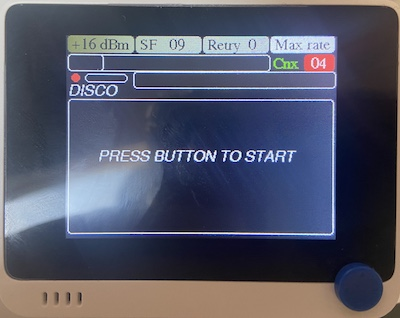
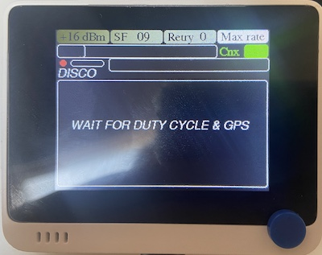
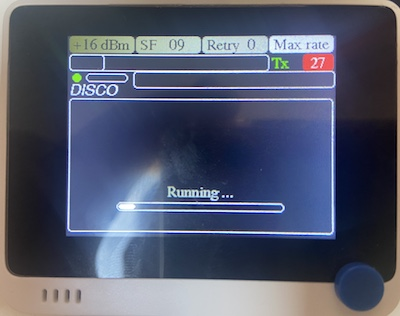
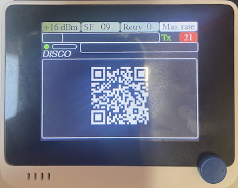
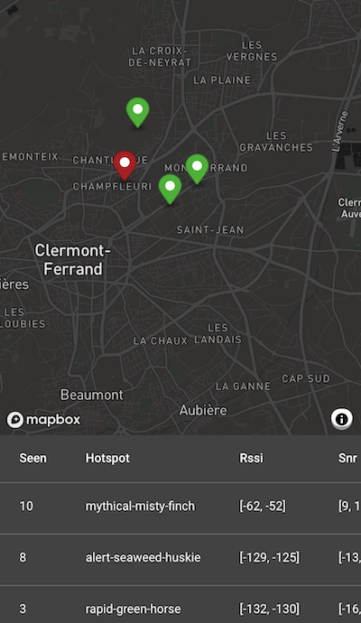

# User Guide

## Seeed Bundle
The Seeed bundle is already configured and ready to use. You have no setup to do to start using it. Communications (data credits) are included, up to 200,000 messages.

## Access the Data Online
The Seeed bundle **is already connected** to the various mapping services, and Helium cargo. For the DIY version, connect the device to the disk91 backend and the mapping services (each via their respective HTTP endpoints). Cargo configuration is documented in the SETUP.md document.

You can access the reported data (once GPS position is correct) on the following services:
- [helium coverage mapping](https://mappers.helium.com)
- [helium tracking - cargo](https://cargo.helium.com)
- [coveragemap mapping](https://coveragemap.net/heatmap/)

## Understanding the Device Usage

 

You can select the transmission power to be used, the spread-factor (speed), and the maximum retries per message by selecting the parameter to modify with the button located on the top side. Once an option is selected, you change the values with UP & DOWN from the 5-direction button.

When none of these parameters are selected, you can change the mode with UP & DOWN. The following modes are available:
- **Manual:** A frame is fired when you push the 5-way button. The downlink response is obtained by pooling.
- **Auto 1h, Auto 15m, Auto 5m, Auto 1m:** A frame is fired automatically every selected time period (e.g., "Auto 15m" sends one every minutes minutes). The downlink response is obtained by pooling.
- **Max Rate:** A frame is fired as soon as the device can, without exceeding the allowable duty cycle. Downlink response will be received later on the flow and will only be monitored from the historical graph.

The status is displayed on the screen and can be:
- **Disc:** disconnected or not yet connected
- **Join:** device is joining the network (bi-directional key establishment process)
- **Cnx:** connected - device has joined, ready to fire messages
- **Tx:** transmission in progress (orange when doing a retry)
- **Dwn:** communication in progress to retrieve the downlink containing the network-side information

The Green / Red square on the right indicates the duty cycle status, when applicable: **green** is ready to communicate; **red** is waiting for the duty cycle timer, with the count-down before being ready.

The Red / Orange / Green circle on the left indicates the GPS status (when activated): **red** is not yet ready, **orange** is position acquired but quality is too poor to be reported, and **green** is good quality position. The location will be reported when green/good GPS quality is obtained.

The Green / Orange / Red bar on the left indicates the battery level status (when battery monitoring is activated).

The last communication result is displayed on the 2 lines under the settings.
- The **first line** shows the Field tester-side information. From left to right, the values are:
	* The sequence ID of the frame
	* The Rssi of the Ack message as received by the Field tester
	* The Snr of the Ack message as received by the Field tester
	* The number of repeat before obtaining the ack response
- The **second line** shows the network-side information. From left to right, the values are:
	* The minimum RSSI value from the different hotspots having received the frame
	* The maximum RSSI value from the different hotspots having received the frame
	* The number of hotspot having received the frame

Rq: Due to the way Helium works or due to the TTNv2 to TTNv3 migration, the second line could display a truncated number of hotspots compared to the reality. For Helium, where this information could be critical, make sure you have done all the configuration steps (i.e., in the Helium Console, ensure you are "buying" the maximum number of packets).

Logged graphs of each of these values can be displayed on the Field tester by using the LEFT & RIGHT buttons to navigate through the screens:

In the historical graphs, a red cross indicates a packet loss, while a green cross indicates a 0 value.
The TX Rssi graph displays a min-max bar (i.e., there is a line for each single response representing the Rssi range among all hotspots).

The different screen are from LEFT to RIGHT:
- **RX RSSI:** Signal level received by the device from the network. Indicates proximity to the LoRaWAN gateway which responded with the ACK.
- **RX SNR:** Signal-to-Noise ratio received by the device from the network. Indicates link quality to the LoRaWAN gateway which responded with the ACK.
- **RETRY:** Number of transmissions on the Field tester before getting an ACK response from the network.
- **TX RSSI:** Signal level received by the network from the device. Indicates the signal quality, as perceived by the network. This has a min and max value, depending on the number of gateways/hotspot receiving the signal. A strong signal indicate a high communication quality and reduce the risk of message loss.
- **Hotspots:** Number of hotspots having received the message from the device. It gives the redundancy of the reception. With Seeed bundle, this is limited to 4 hotspots as a maximum at a time. For Helium, the maximum number of packets to "buy" (and then the maximum number of hotspots which can be detected in this graph) is configurable from the Helium Console.
- **Distance:** The distance (in km) to the different hotspots having received the message from the device. This displays the min and max distance.

## Lock Screen Mode
From version 1.10, you can lock the keys and switch the screen off when mapping, this is useful when your device is in a pocket or a bag. You must be in one of the graph screen and one of the Auto mode (including Max rate).
- To lock the keys, hold the 5 directions button and within a second, clic on the top button located on the right side. A red line will appear on top of the screen to confirm keys are locked. release the 5 direction button.
- To lock the keys and switch screen off, you do the same with the top button located on the center. The screen will switch off.

To unlock the keys, just repeat the same operation.

## Discovery Mode

The Discovery Mode sends uplink messages with no ACK to get the maximum number of hotspots capturing the information. The backend server saves this information in a session that can be diplayed at the end of the discovery. On the final step, a QR code gives the link to see the discovery results on your smartphone.

To reach the Discovery Mode, push the 5-way button to the right repeatedly, up to the last screen.

To start a discovery session, it is better to be already connected to the network. You need to have GPS coverage and the duty cycle timer needs to be ended. The Discovery Mode duration is over 5 minutes. The progression bar indicates that Discovery Mode is in progress.

Discovery Mode ignores your SF setting; SF10 is always used. The Tx Power option is still considered, however.

At the end, you get the "R code link for displaying the result on your smartphone.

Please note that the Discovery Mode sessions are accumulated when performed within the same hour, and are purged after 2 hours (subject to change).

