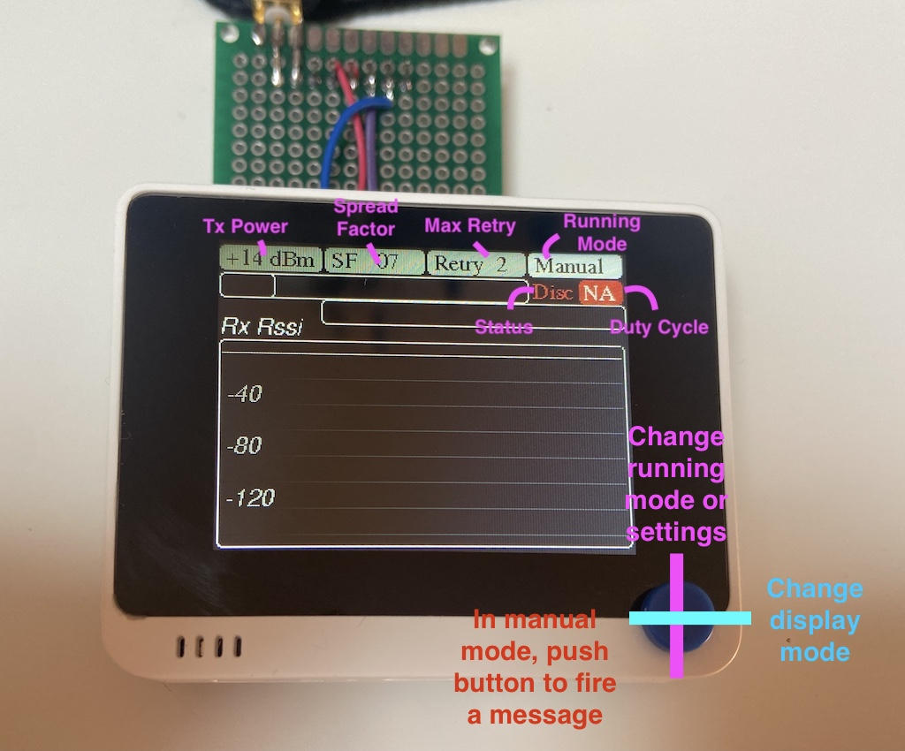
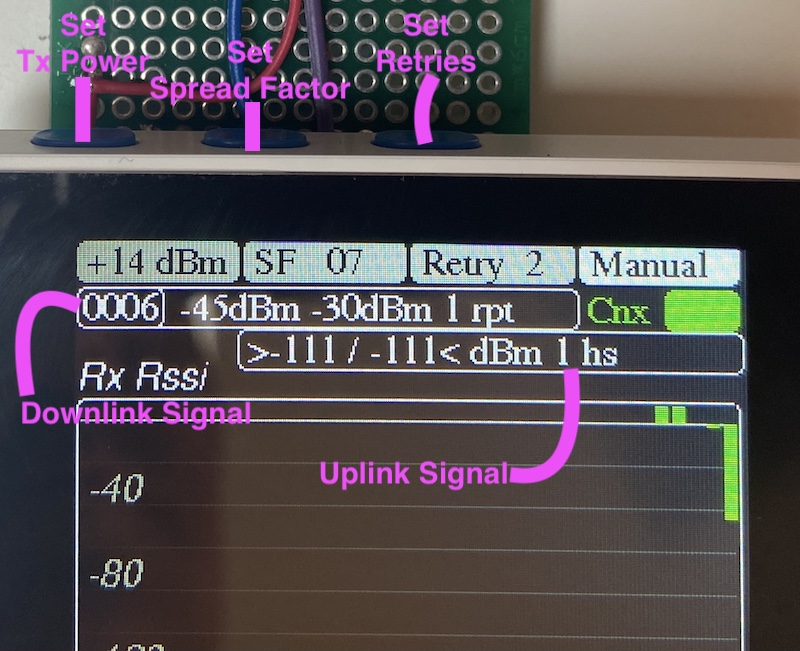
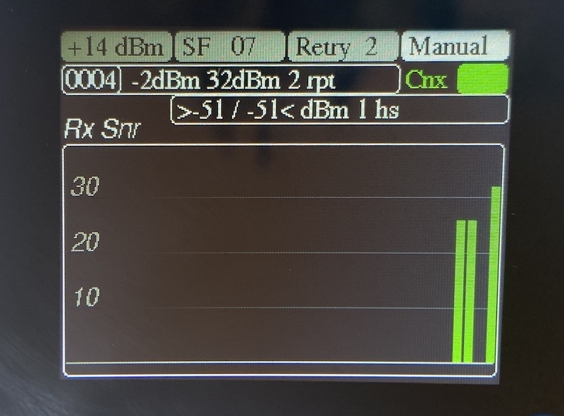
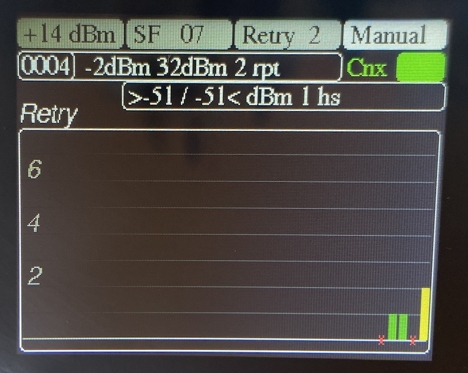
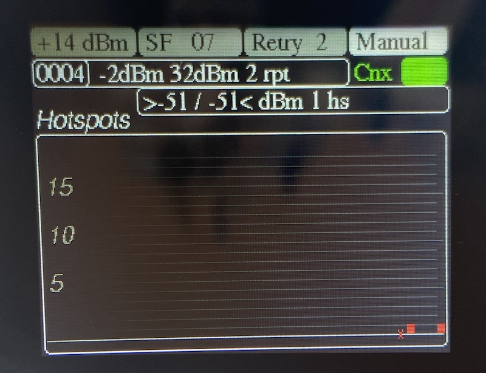

# User Guide

** This page will be updated soon with the last features addede recently**

 

You can select the transmission power to be used, the spread-factor (speed), the maximum retries allowed by selecting the parameter to modify with the button located on the top side. Once selected, you change the values with UP & DOWN from the 5 directions button.

When none of these parameters are selected, you can change the mode with the UP & DOWN. The following modes are available:
- Manual : a frame is fired when pushing the 5 ways button. The downlink response is obtained by pooling.
- Auto 5m : a frame is fired automatically every 5 minutes. The downlink response is obtained by pooling.
- Auto 1m : a frame is fired automatically every 1 minute. The downlink response is obtained by pooling.
- Max Rate : a frame is fired as soon as the device can regarding the eventual Duty Cycle. Downlink response will be received later on the flow and will onlu be monitored from the historical graph.

The status is displayed on the screen and can be:
- Disc - disconnected or not yet connected
- Join - device is joining the network
- Cnx - device has joined, ready to fire messages
- Tx - transmisison in progress (orange when doing a retry)
- Dwn - communication in progress to retrieve the downlink containing the network side informations

The Green / Red square on the righ is indicating the duty-cycle status when applicable. Green is ready to communicate, Red is duty-cycle with the count-down before being ready.

The Red / Orange / Green circle on the left is indicating the GPS status (when activated). Red is not yet ready, Orange is position aquired but quality is poor to be reported. Green is good quality position ; it will be reported then.

The Green / Orange / Red bar on the left is indicating the battery level status (when activated)

The last communication result is displayed on the 2 lines under the settings.
- The first line shows the device side information ( from left to right ):
	* The sequence ID of the frame
	* The Rssi of the Ack message as received by the Field tester
	* The Snr of the Ack message as received by the Field tester
	* The number of repeat before obtaining the ack response
- The second line shows the network side information ( from left to right):
	* The minimum RSSI value from the different hotspots having received the frame
	* The maximum RSSI value from the different hotspots having received the frame
	* The number of hotspot having received the frame.

Rq : due to the way Helium works or due to the TTNv2 to TTNv3 migration, the second line could display a reduced number of Hotspot compared to the reality. For Helium where this information could be critical, make sure you have done all the configuration steps and bought all the frame setting. Currently Helium has a bug and not execute this action correctly so in most of the cases you will have only one Hotspot response. I'll update that documentation once it will be fixed.

All these information can be displays with an historical graph you select using the LEFT & RIGHT buttons:

In the historical graph, a red cross is indicating a packet loss a green cross a 0 value.
The TX Rssi graph is displaying a min-max bar, this is why you see just a line for a single hotspot response.
